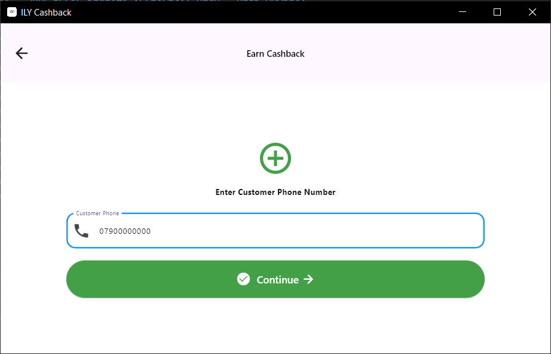
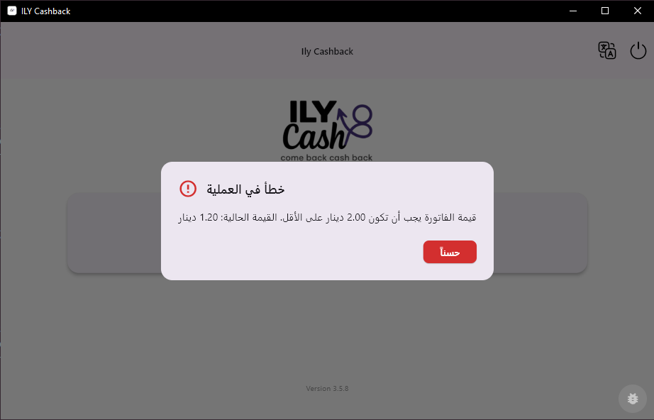

# Getting Started with ILY Cash

Welcome to ILY Cash - the professional cashback management system for retail businesses in Jordan.

## What is ILY Cash?

ILY Cash is a Windows desktop application that enables merchants to:

* **Earn Cashback**: Process customer purchases and award cashback points
* **Burn Cashback**: Allow customers to redeem their accumulated points
* **Real-Time Integration**: Receive WhatsApp-triggered transactions automatically
* **Bill Auto-Submit**: Automatically process bills from POS terminals
* **Fraud Prevention**: Built-in security with PIN lock and duplicate detection

***

## System Requirements

### Minimum Requirements

* **OS**: Windows 10 or later (64-bit)
* **RAM**: 4 GB
* **Storage**: 200 MB free space
* **Network**: Stable internet connection
* **Printer**: USB thermal printer (for receipt printing, optional)

### Recommended

* **OS**: Windows 11
* **RAM**: 8 GB or more
* **Network**: High-speed internet (10 Mbps+)

***

## Installation

### Step 1: Download

1. Go to [GitHub Releases](https://github.com/psdew2ewqws/ily-cashback/releases)
2. Download the latest version (v3.5.9 or newer)
3. Extract the ZIP file to your desired location

**Recommended location**: `C:\Program Files\ILY Cash\`

### Step 2: First Run

1. Navigate to the extracted folder
2. Double-click `ILY_Cash.exe`
3. Windows may show a security warning:
   * Click "More info"
   * Click "Run anyway"
4. The application will launch

### Step 3: Login

1. Enter your **employee phone number** (10 digits, e.g., 07912345)
2.
3. Enter your **password**
4. Click **Login**

**First-time users**: Contact your system administrator for login credentials.

***

## Home Screen Overview

After successful login, you'll see the main dashboard:

### Main Features

**1. Earn Cashback Button** (Green)

* Process customer purchases
* Award cashback points
* Validate bills and prevent fraud

**2. Burn Cashback Button** (Red)

* Redeem customer points
* Print receipts
* View customer credit balance

**3. Status Indicators** (Top bar)

* **Server Status**: Shows connection to backend
* **Employee Info**: Your name and branch
* **Language Toggle**: Switch between English/Arabic

**4. System Tray** (Bottom right)

* App minimizes to system tray
* Real-time notifications appear here
* Right-click icon for quick actions

***

## Quick Start Guide

### Process Your First Transaction (Earn)

**Step 1: Click "Earn Cashback"**

**Step 2: Enter Customer Phone**

* Enter customer's phone number (10 digits)
* Number will be cleaned automatically (removes spaces, dashes)
* Click "Next" or press Enter

**Step 3: Fill Transaction Form**

Fill in all required fields:

* **OTP**: Customer receives this via SMS
* **Bill Value**: Purchase amount (minimum 2.00 JOD)
* **Bill Number**: From receipt (e.g., 31622831761)
* **Full Name**: Customer's name
* **Mobile**: Pre-filled from Step 2

**Step 4: Submit**

* Click "Submit" button
* Wait for processing (3-5 seconds)
* Success dialog will appear

**Step 5: Success!**

You'll see:

* Transaction confirmation
* Bill number
* Cashback amount earned
* Customer phone (masked for privacy)

Click "OK" to return to home screen.

***

## Common Scenarios

### Scenario 1: WhatsApp Auto-Trigger

When a transaction is sent via WhatsApp:

1. **Notification appears** in system tray
2. **App auto-navigates** to transaction page
3. **Form auto-submits** (no manual input needed)
4. **Result dialog shows** - approve or dismiss

**Indicator**: Phone number starts with "E-" (e.g., E-0790000000)

### Scenario 2: Bill Auto-Submit

When POS terminal processes a bill:

1. **Bill detected** at `C:\ily\extracted.txt`
2. **15-minute timer starts** automatically
3. **If not manually processed** → Auto-submits to monitoring phone
4. **No duplicate processing** - system tracks all bills

**Monitor in console**: Look for `💾 RECORDING REDEMPTION` logs

### Scenario 3: Security PIN Lock

After 2+ transactions for same phone within 12 hours:

1. **Red security alert appears**
2. **Enter PIN**: 2941 (contact admin if different)
3. **Click "Unlock"**
4. **Transaction proceeds** after correct PIN
5. **Counter resets** after unlock

**Why this happens**: Fraud prevention system to stop abuse

***

## Language Support

ILY Cash supports **English** and **Arabic**.

### Switch Language

1. Click **language toggle** (top right)
2. Select **العربية** or **English**
3. App restarts with new language
4. All dialogs, buttons, and messages update

**Arabic Example**:

All error messages, success dialogs, and UI elements are fully localized.

***

## Daily Operations

### Start of Day

1. **Launch ILY Cash**
2. **Login** with your credentials
3. **Check server status** (green indicator = connected)
4. **Verify printer** is connected and has paper (if using burn feature)

### During Operations

* **Keep app running** in background (minimizes to system tray)
* **Watch for notifications** from WhatsApp auto-triggers
* **Process transactions** as customers arrive
* **Monitor security alerts** (PIN lock dialogs)

### End of Day

1. **Complete any pending transactions**
2. **Check bill auto-submit** status (admin only)
3. **Minimize to tray** (don't close - keeps WebSocket active)
4. **Log out** if required by your business

**Note**: ILY Cash can run 24/7 for automatic bill processing.

***

## Auto-Update System

ILY Cash automatically checks for updates.

### Update Process

1. **Immediate check** - 10 seconds after app starts
2. **Daily check** - Every day at 11:00 AM (Jordan time)
3. **Notification appears** if update available
4. **Click "Install"** to download
5. **App restarts** with new version
6. **Changes applied** automatically

**No admin privileges required** for updates.

**Current version**: Check bottom left of home screen or About dialog

***

## Troubleshooting Quick Reference

| Issue                    | Solution                                               |
| ------------------------ | ------------------------------------------------------ |
| Can't login              | Verify phone number format (10 digits), check password |
| Server connection failed | Check internet, verify backend is running              |
| Bill rejected            | Check minimum 2.00 JOD, verify not duplicate           |
| PIN lock appearing       | Enter PIN 2941, contact admin if persists              |
| Arabic text not showing  | Install Arabic font pack for Windows                   |
| Printer not working      | Check USB connection, verify printer drivers           |

**For detailed troubleshooting**: See [Troubleshooting Guide](docs/en/troubleshooting/common-errors.md)

***

## Next Steps

Now that you're set up:

1. **Read**: [How to Process Cashback](docs/en/how-to/process-cashback.md)
2. **Learn**: [Understanding Errors](docs/en/troubleshooting/common-errors.md)
3. **Explore**: [Technical Documentation](docs/en/technical/architecture.md)
4. **Configure**: [System Configuration](docs/en/technical/configuration.md)

***

## Need Help?

* **Technical Issues**: Contact IT support
* **Account Problems**: Contact your system administrator
* **Feature Requests**: Submit via GitHub Issues
* **Documentation Errors**: Report on documentation repository

**Support Hours**: Sunday - Thursday, 9 AM - 5 PM (Jordan Time)

***

**Welcome to ILY Cash! You're ready to start processing transactions.** 🎉
