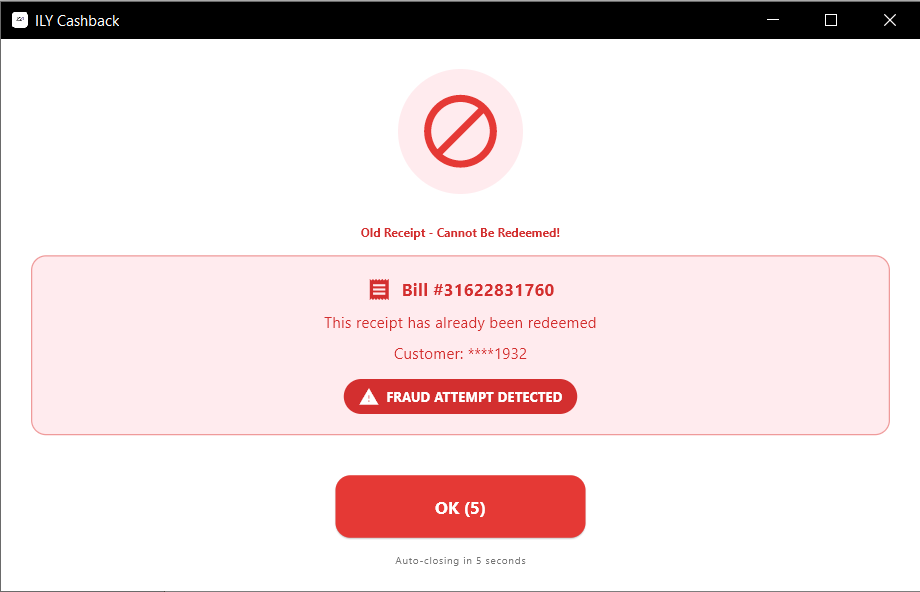

# How to Process Cashback

Complete guide to processing cashback transactions for customers.

---

## Before You Start

### Required Information
- **Customer's phone number** (10 digits, format: 07XXXXXXXX)
- **OTP code** (customer receives via SMS)
- **Bill number** (from receipt/invoice)
- **Bill total amount** (minimum 2.00 JOD)
- **Customer's full name**

### System Requirements
- Active internet connection
- ILY Cash app running and logged in
- Server status indicator showing green (connected)

---

## Processing Cashback - Complete Flow

### Step 1: Access Earn Cashback

From the home screen, click the **"Earn Cashback"** button (green button).


---

### Step 2: Enter Customer Phone Number


1. **Enter** customer's mobile number
   - Format: 10 digits starting with 07
   - Example: `0791234567`
   - Don't include: spaces, dashes, country code

2. **Click "Next"** or press Enter

**Phone Number Cleaning**:
- App automatically removes spaces and dashes
- Converts +962 to 07 if entered
- Validates format before proceeding

---

### Step 3: OTP Sent to Customer

After entering phone number:

1. **System sends OTP** to customer's phone via SMS
2. **Customer receives** 4-digit code
3. **Wait for customer** to tell you the OTP

**Typical wait time**: 5-15 seconds for SMS delivery

---

### Step 4: Fill Transaction Form


Now you'll see the complete earn cashback form. Fill in ALL fields:

#### Field 1: OTP Code
- **Ask customer** for the 4-digit code they received
- Example: `1234`
- Must be entered within 5 minutes of being sent

#### Field 2: Bill Value
- **Enter purchase amount** in Jordanian Dinars
- Format: Numbers with up to 2 decimal places
- Example: `25.50` or `2.00`
- **Minimum: 2.00 JOD** (enforced)

**If bill < 2 JOD**: You'll see this error:


The system will reject the transaction with message:
> "قيمة الفاتورة يجب أن تكون 2.00 دينار على الأقل"
> (Bill value must be at least 2.00 JOD)

#### Field 3: Bill Number
- **Enter receipt/invoice number**
- Can contain letters and numbers
- Example: `31622831761`
- Used for duplicate detection

#### Field 4: Full Name
- **Enter customer's full name** as it appears on their ILY account
- Example: `Ahmad Mohammad`

#### Field 5: Mobile
- **Pre-filled** with phone number from Step 2
- Verify it's correct
- Can edit if needed

---

### Step 5: Submit Transaction

1. **Review all fields** carefully
2. **Verify** bill number is correct (no typos)
3. **Click "Submit"** button
4. **Wait 3-5 seconds** for processing

**What happens during processing**:
1. System validates OTP code
2. Checks bill amount ≥ 2.00 JOD
3. Verifies bill not previously submitted (fraud check)
4. Checks for suspicious activity (security check)
5. Creates transaction in backend
6. Records redemption locally

---

## Success! Transaction Complete

### Success Dialog


When successful, you'll see:

**Information displayed**:
- ✅ Success message in current language
- 📄 **Bill Number**: Confirmation of bill processed
- 💰 **Cashback Amount**: Points credited to customer (e.g., 0.1 JD)
- 👤 **Customer Phone**: Last 4 digits shown (e.g., ****1932)

**Next steps**:
1. Click "OK" or dialog auto-closes after 10 seconds
2. Returns to home screen
3. Customer receives confirmation SMS
4. Points immediately available in customer's account

---

## Common Error Scenarios

### Error 1: Bill Amount Too Low


**When it happens**: Bill value entered is less than 2.00 JOD

**Error message** (Arabic):
> خطأ في العملية
> قيمة الفاتورة يجب أن تكون 2.00 دينار على الأقل

**Translation**:
> Error in operation
> Bill value must be at least 2.00 JOD

**Solution**:
1. **Check** bill amount is correct
2. **Re-enter** if there was a typo
3. If bill is actually < 2 JOD, inform customer they don't qualify
4. Click "OK" to try again

---

### Error 2: Duplicate Bill (Fraud Detection)



**When it happens**: Bill number already submitted (within last 30 days)

**Error message** (Red alert):
> Old Receipt - Cannot Be Redeemed
> **FRAUD ATTEMPT DETECTED**

**Details shown**:
- Original bill number
- Date/time of original submission
- Warning about fraud attempt

**Solution**:
1. **DO NOT** override this warning
2. **Double-check** bill number is correct
3. If customer insists they didn't redeem it before:
   - Contact ILY support to investigate
   - Do not process manually
4. **Possible causes**:
   - Customer trying to redeem same bill twice
   - Bill number typo matches old bill
   - System detected suspicious pattern

**Why this is critical**: Prevents customers from redeeming the same receipt multiple times (fraud).

---

### Error 3: Customer Blacklisted (Fraud Alert)


**When it happens**: Customer's phone number is on fraud blacklist

**Error message** (Orange warning):
> Customer Blocked
> Phone: ****1932

**Solution**:
1. **DO NOT PROCESS** the transaction
2. **Politely inform** customer to contact ILY support
3. **Click "Close"** to return to home
4. **Report to manager** if customer becomes aggressive

**Important**: This is a backend blacklist - customer has been flagged by ILY system for fraudulent activity. Do not override.

---

### Error 4: Security PIN Lock Triggered


**When it happens**: Same phone number has 2+ transactions within 12 hours

**Security Alert displays**:
> SECURITY ALERT
> Suspicious activity detected
> Enter security PIN to continue

**Why it triggers**:
- Fraud prevention system
- Detects unusual patterns (multiple transactions, same customer)
- Configured to allow 1 transaction per 12 hours per phone

**Solution**:
1. **Red security dialog appears** (cannot be dismissed)
2. **Enter PIN**: `2941` (or contact admin for correct PIN)
3. **Click "Unlock"**
4. If PIN correct:
   - Transaction proceeds normally
   - Counter resets
   - Redemption history cleared
5. If PIN incorrect:
   - Transaction blocked
   - Must enter correct PIN to continue

**When to be concerned**:
- Customer trying to redeem multiple times
- Possible fraud attempt
- May need to escalate to manager

**Configuration**: See `lib/config/security_config.dart`
- Max redemptions: 1
- Time window: 12 hours
- Security PIN: 2941 (hardcoded)

---

## Special Scenarios

### Scenario 1: WhatsApp Auto-Triggered Transaction

When backend sends transaction via WhatsApp:

**How it works**:
1. **Notification** appears in system tray
2. **App auto-navigates** to earn cashback page
3. **Phone number** starts with "E-" (e.g., E-0791234567)
4. **Form auto-submits** (no user interaction)
5. **Result dialog** shows success or error

**Your role**:
- Monitor the result dialog
- If error, handle manually
- No manual input needed for auto-flow

**Indicator**: Phone number format `E-{number}` means auto-triggered

---

### Scenario 2: Bill Auto-Submit from POS

When bill is detected at POS terminal:

**System behavior**:
1. **Bill saved** to `C:\ily\extracted.txt`
2. **15-minute timer** starts automatically
3. **If you process manually** within 15 minutes:
   - Timer cancels
   - Transaction completes normally
4. **If timer expires**:
   - System auto-submits to monitoring phone
   - No manual action needed

**Console logs**:
```
💾 RECORDING REDEMPTION
💾 Bill: 31622831761
💾 ✅ SAVED: Total redemptions for this phone now: 1
```

**To prevent auto-submit**: Process the bill manually before timer expires.

---

### Scenario 3: Monitoring Phone (Whitelisted)

**Special phone number** (configured in config.json):
- Default: `0790000001`
- **Exempt** from all security checks
- **No PIN lock** ever
- **Unlimited** redemptions allowed
- Used for testing and auto-submit system

**If you see this phone**: It's for internal/testing purposes only.

---

## Validation Rules

### Phone Number Validation
- **Format**: Must be 10 digits
- **Start with**: 07 (Jordan mobile prefix)
- **Pattern**: `^07\d{8}$`
- **Allowed**: 0790000000 to 0799999999

### Bill Amount Validation
- **Minimum**: 2.00 JOD (enforced)
- **Format**: Numeric with up to 2 decimal places
- **Examples**: ✅ 2.00, 25.50, 100.00 | ❌ 1.99, 1.50, ABC

### Bill Number Validation
- **Format**: Alphanumeric
- **Uniqueness**: Checked against last 30 days
- **Case-sensitive**: YES
- **Duplicates**: Blocked with fraud warning

### OTP Validation
- **Format**: 4-digit code
- **Expiry**: 5 minutes after generation
- **Attempts**: Unlimited (but OTP changes each request)

---

## Security Features

### Fraud Detection
1. **Duplicate Bill Check**: Prevents same bill from being redeemed twice
2. **Suspicious Pattern Check**: Monitors redemption frequency per phone
3. **PIN Lock**: Requires manager PIN after threshold
4. **Blacklist Check**: Backend-maintained fraud list
5. **Bill Expiry Check**: Validates bill is not too old

### Data Recording
Every transaction is recorded in:
- **SharedPreferences**: Local fraud detection history
- **Backend Database**: Central transaction log
- **Console Logs**: Debug information (💾 and 🔒 prefixes)

### Whitelist System
- **Monitoring phone** exempt from security
- **Admin accounts** may have special privileges
- **Test accounts** configured per branch

---

## Troubleshooting Checklist

**Before submitting**:
- [ ] Internet connection active (check status indicator)
- [ ] Customer confirmed phone number
- [ ] OTP received by customer (wait 5-15 seconds)
- [ ] Bill amount ≥ 2.00 JOD
- [ ] Bill number entered correctly (no typos)
- [ ] Customer's full name provided

**If transaction fails**:
- [ ] Check error message carefully
- [ ] Verify all fields again
- [ ] Check console logs (if admin)
- [ ] Try again after fixing issue
- [ ] Contact support if error persists

**Common mistakes**:
- Wrong OTP code entered
- Bill number typo
- Forgotten to check minimum amount
- Processing duplicate bill
- Network connection lost mid-transaction

---

## Quick Reference

| **Step** | **Action** | **Expected Time** |
|----------|-----------|-------------------|
| 1 | Enter phone | 5 seconds |
| 2 | Wait for OTP | 5-15 seconds |
| 3 | Fill form | 30-60 seconds |
| 4 | Submit | 3-5 seconds |
| 5 | Success dialog | Instant |

**Total time per transaction**: ~1-2 minutes

---

## Next Steps

- **Learn about errors**: [Common Errors Guide](../troubleshooting/common-errors.md)
- **WhatsApp integration**: [Auto-Trigger System](whatsapp-integration.md)
- **Technical details**: [Security System](../technical/security.md)
- **API documentation**: [Backend APIs](../technical/api.md)

---

## Need Help?

- **Transaction stuck**: Check internet, retry after 30 seconds
- **PIN lock appearing often**: Contact admin to review security config
- **Customer complaints**: Direct to ILY support
- **System errors**: Check [Troubleshooting Guide](../troubleshooting/common-errors.md)

**Support contact**: Your system administrator or ILY support team

---

**Pro tip**: Always double-check the bill number before submitting - it's the most common source of errors and cannot be changed after submission.
